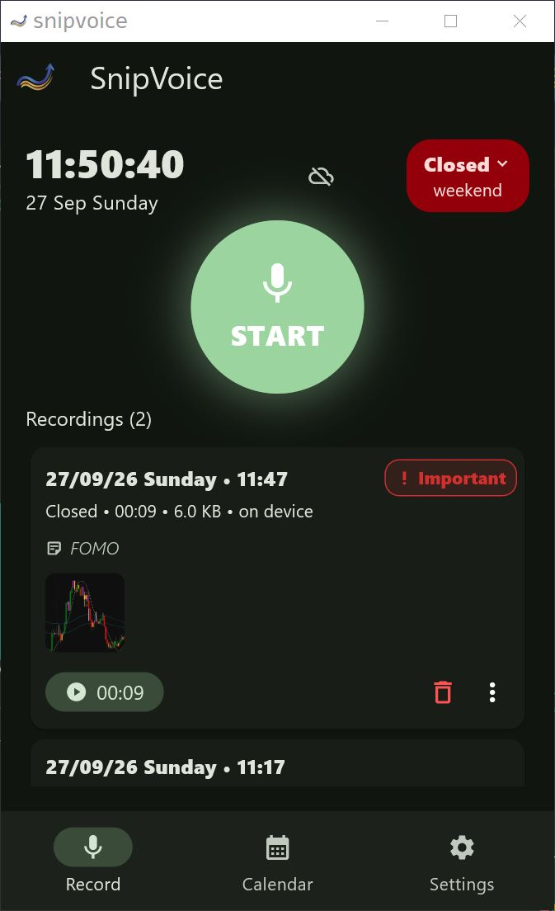
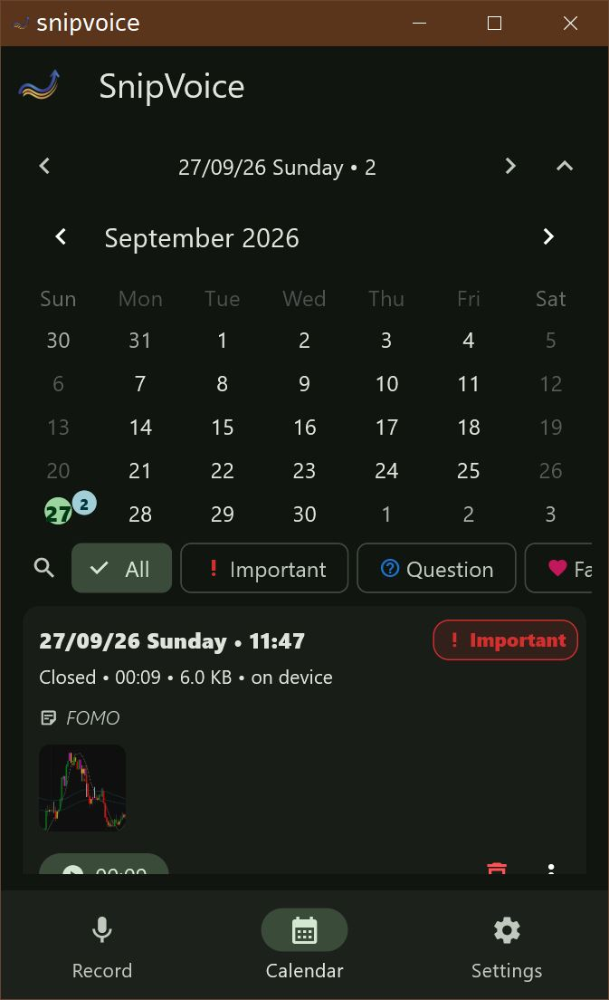
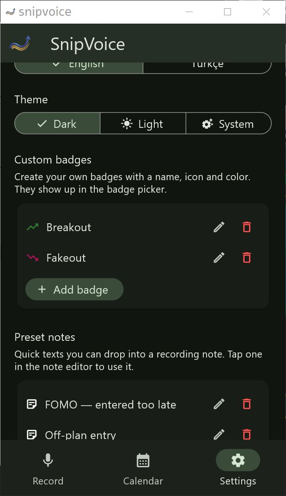

# SnipVoice

**Press, talk, listen.** A voice journal for traders: record the thoughts and
feelings you have before, during and after a trade.

## Why a voice journal?

A trading journal is only worth anything if you actually keep it, and typing is
the slowest part - so you stop writing and six months later you have three
entries. SnipVoice is a trading journal you *speak*: one big button, and the
thought is saved in two seconds while it is still fresh. Every entry is tagged
with the market session it happened in (Asia, London, New York, ...), so later
you can review your own behaviour by time of day instead of guessing.

## Not only for trading

Nothing in the app is trading-specific apart from the session badge and the
market-hours sheet. Any situation where talking beats typing works exactly the
same way:

- **Private journal** - therapy-style notes, the things you never write down
- **Daily standup or handover** - speak your update, attach a screenshot
- **Language practice** - say a sentence, play it back, correct yourself
- **Ideas and drafts** - talk through a plan, a book note, a lecture
- **Any recurring habit** - workouts, study sessions, a walk, a commute

The trader part is the session badge. Ignore it and SnipVoice is a plain
one-button voice recorder with a calendar, notes, tags and images.

One screen, one big button, a clock with a session badge, a calendar. No clutter.

Written in Flutter, so the same codebase ships as a Windows desktop app and an
Android APK.

## Screenshots

| Record | Calendar | Settings |
| --- | --- | --- |
|  |  |  |

## Features

- One-tap voice recording (m4a) with a live waveform; if the app is closed while
  recording, the entry is still saved
- **Session badge** - Asia / Pre-London / London AM / Pre-NY / NY AM / NY PM /
  Closed, derived from New York time, with a tappable market-hours sheet
- Custom badges (user-defined tags) plus reusable note templates
- Calendar screen with per-day entries and dot markers
- Attach notes and images, share an entry, open the file externally
- 30s undo (trash) with restore and permanent delete
- Turkish and English UI, light and dark theme
- **Offline-first**: entries live on the device first and sync to Supabase in
  the background once it is configured. Without a `.env` file the app runs
  fully offline.

## Install - download

Grab the latest build from [Releases](https://github.com/snipdev/snipvoice/releases):

| Platform | File | Notes |
| --- | --- | --- |
| Windows x64 | `snipvoice-windows-x64-<version>.zip` | Extract the zip, run `snipvoice.exe` |
| Android | `snipvoice-<version>.apk` | Signed with the debug key, so it cannot go to the Play Store |

On Windows: right-click the zip > **Extract All** > run `snipvoice.exe`.
On Android you have to allow "Install unknown apps" for your browser or file
manager.

## Build from source

Requirements: Flutter 3.47.5 (stable), Visual Studio 2022 with the
"Desktop development with C++" workload for Windows, JDK 17 and Android SDK 36
for Android.

```powershell
git clone https://github.com/snipdev/snipvoice.git
cd snipvoice
flutter pub get

# run
flutter run -d windows
flutter run                 # with a connected Android device

# build
flutter build windows --release   # build\windows\x64\runner\Release\snipvoice.exe
flutter build apk --release       # build\app\outputs\flutter-apk\app-release.apk
```

### Supabase (optional sync)

1. Run `supabase/voice_journal.sql` in the Supabase **SQL Editor**
2. Copy `.env.example` to `.env` and fill in `SUPABASE_URL` and
   `SUPABASE_PUBLISHABLE_KEY`

```
SUPABASE_URL=https://<project>.supabase.co
SUPABASE_PUBLISHABLE_KEY=<publishable key>
```

`.env` is gitignored. The keys are read from the environment at startup rather
than compiled in, which is why a release APK built without them simply runs
offline.

## Project layout

```
lib/
  main.dart                      # bottom navigation (Record / Calendar / Settings), theme, locale
  models/                        # voice_entry, badge_def, entry_badge
  screens/                       # home, calendar, settings
  services/                      # audio, playback, library (local + Supabase),
                                 # storage, session, badge, note preset, entry media
  widgets/                       # recording wave, badge picker, note editor, undo bar, ...
  l10n/                          # app_tr.arb / app_en.arb -> generated localizations
supabase/voice_journal.sql       # table + storage bucket + RLS policies
.github/workflows/               # CI (analyze + test) and Release (Windows + APK)
```

## How a release is cut

Pushing a tag is all it takes; GitHub Actions builds the artifacts and
attaches them to the release:

```powershell
# bump `version:` in pubspec.yaml first
git tag v0.2.0
git push origin v0.2.0
```

`.github/workflows/release.yml` then runs:

1. `windows-latest` -> `flutter build windows --release` -> `snipvoice-windows-x64-<v>.zip`
2. `ubuntu-latest` -> `flutter build apk --release` -> `snipvoice-<v>.apk`
3. `gh release create` (a re-run via `workflow_dispatch` falls back to
   `gh release upload --clobber`)

Note: release APKs are currently signed with the **debug key**
(`android/app/build.gradle.kts` -> `signingConfigs.getByName("debug")`).
Publishing to the Play Store requires adding a real `key.properties` +
keystore pair; `.gitignore` already excludes `*.keystore` and
`key.properties`.

## License

[MIT](LICENSE)
